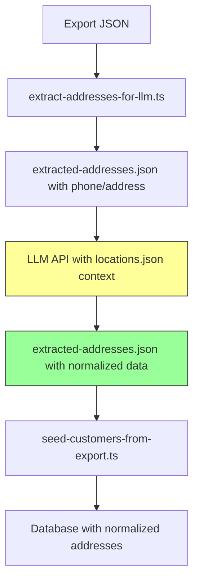

# LLM-Powered Address Normalization for Customer Seeding

This document describes the implementation of LLM-powered address normalization for importing customer data into the ARMA Dashboard.

## Overview

The customer seeding process now supports **LLM-powered address normalization** in addition to heuristic-based parsing. This approach leverages Large Language Models (like Grok, GPT-4, or Claude) to accurately parse and normalize unstructured Bangladeshi addresses, handling spelling mistakes, abbreviations, and inconsistent formats.

## Architecture

### 1. Address Extraction (`extract-addresses-for-llm.ts`)

**Purpose**: Prepares customer addresses for LLM processing by extracting unique phone-address pairs.

**Process**:
1. Reads `arma-data-export-2025-09-19T08-13-19-123Z.json`
2. Deduplicates customers by phone number
3. Extracts `{phone, address}` pairs
4. Saves to `extracted-addresses.json`

**Usage**:
```bash
tsx scripts/extract-addresses-for-llm.ts
```

**Output** (`extracted-addresses.json`):
```json
[
  {
    "phone": "01715-547334",
    "address": "108, Dhupchhaya, Lakes Circus, Kolabagan, Dhaka"
  }
]
```

### 2. LLM Normalization (External/Manual)

**Purpose**: Use an LLM to intelligently parse and normalize addresses.

**Recommended LLMs**:
- **Groq** (fast, cost-effective): ~$0.10/1M tokens
- **OpenAI GPT-4o**: High accuracy, ~$2.50/1M tokens
- **Anthropic Claude**: Good at structured outputs

**System Prompt**:
```
You are an expert in Bangladesh geography and address normalization. Your task is to parse unstructured addresses and map them to structured components using the provided locations data. Handle spelling mistakes, abbreviations, and variations (e.g., "Dhakka" → "Dhaka", "Kolobagan" → "Kolabagan").

Reference Data (locations.json):
- Structure: Array of regions with "name" (e.g., "Dhaka - North") and "zones" array
- Divisions are top-level (e.g., "Dhaka" from "Dhaka - North")
- Districts are inferred from division
- Zones/Upazilas are in "zones" arrays

For each input {phone, address}:
- Extract:
  - division: Closest matching division name
  - district: Closest matching district
  - zone: Closest matching zone/upazila name
  - addressLine: Cleaned street/house details
- If no match, set to null and explain in "notes"
- Add "confidence" (0-1): 1.0 for exact, 0.8+ for fuzzy, <0.5 if guessed
- Output ONLY valid JSON: Array of {phone, normalized: {division, district, zone, addressLine, confidence, notes}}

Be conservative - if unsure, set fields to null and explain.
```

**User Message**:
```
Locations Reference (full JSON):
[PASTE FULL contents of locations.json]

Input Addresses (array):
[PASTE contents of extracted-addresses.json]

Normalize each address. Output ONLY the JSON array.
```

**Expected Output** (save as `extracted-addresses.json`, overwriting):
```json
[
  {
    "phone": "01715-547334",
    "normalized": {
      "division": "Dhaka",
      "district": "Dhaka - South",
      "zone": "Kalabagan",
      "addressLine": "108, Dhupchhaya, Lakes Circus",
      "confidence": 0.9,
      "notes": "Corrected spelling from 'Kolabagan' to 'Kalabagan'."
    }
  }
]
```

### 3. Customer Seeding with LLM Data (`seed-customers-from-export.ts`)

**Purpose**: Imports customers using LLM-normalized addresses or heuristic fallback.

**Key Changes**:
- **`loadNormalizedAddresses()`**: Loads LLM-processed `extracted-addresses.json` into a Map
- **`getAddress(phone, addressString)`**: Tries LLM data first, falls back to heuristic parsing
- **Confidence Tracking**: Logs warnings for normalizations with confidence < 0.7
- **Metadata Storage**: Stores original address + LLM confidence/notes in `addresses.details` JSONB

**Usage**:
```bash
tsx scripts/seed-customers-from-export.ts \
  ./scripts/arma-data-export-2025-09-19T08-13-19-123Z.json \
  ./scripts/extracted-addresses.json
```

**Process Flow**:
1. Load LLM-normalized addresses (if available)
2. Load geographical data (divisions, districts, zones) from DB
3. For each customer:
   - Try to get address from LLM normalization map (by phone)
   - If not found, use heuristic parsing
   - Warn if confidence < 0.7
   - Map division/district/zone names to DB IDs
   - Store address with metadata

**Output Example**:
```
🌱 Starting customer seeding from export...
📊 Found 14 customers to seed
📍 Loading LLM-normalized addresses...
✅ Loaded 11 normalized addresses from LLM
📍 Loading geographical data...
✅ Loaded 8 divisions, 64 districts, 6360 zones
✅ Seeded 10 customers...

📊 Seeding Summary:
✅ Successfully seeded: 11
⏭️  Skipped (duplicates): 0
❌ Errors: 0
⚠️  Low confidence (<0.7) normalizations: 0
🎉 Customer seeding completed!
```

## Database Schema

**`addresses` table**:
- `addressLine`: Street/house details (from LLM)
- `divisionId`, `districtId`, `zoneId`: Foreign keys
- `details` (JSONB): Stores metadata for non-perfect normalizations:
  ```json
  {
    "original": "108, Dhupchhaya, Lakes Circus, Kolabagan, Dhaka",
    "llm_confidence": 0.9,
    "llm_notes": "Corrected spelling from 'Kolabagan' to 'Kalabagan'."
  }
  ```

## Benefits of LLM Normalization

1. **Spelling Correction**: "Dhakka" → "Dhaka", "Kolobagan" → "Kalabagan"
2. **Abbreviation Expansion**: "Rd." → "Road"
3. **Context Understanding**: "Lakes Circus, Kolabagan" → zone "Kalabagan"
4. **Fuzzy Matching**: Handles typos and variations
5. **Confidence Scores**: Allows manual review of uncertain normalizations
6. **Metadata Tracking**: Preserves original data for audit trails

## Fallback Strategy

If `extracted-addresses.json` is not found or LLM normalization fails:
1. Script continues with **heuristic parsing** (original logic)
2. Checks for "Dhaka" in address
3. Searches for known zones in `locations.json`
4. Uses default division/district/zone if not found

This ensures **robustness** even without LLM processing.

## Cost Estimation

**For 14 customers**:
- Input: ~100 tokens/address × 14 = 1,400 tokens
- Locations context: ~20,000 tokens
- Output: ~150 tokens/address × 14 = 2,100 tokens
- **Total**: ~23,500 tokens

**Cost** (via Groq at $0.10/1M tokens): **~$0.002** (negligible)

**Scaling** (1,000 customers): ~$0.14 via Groq, ~$3.50 via GPT-4o

## Workflow Summary



## Future Enhancements

1. **Automated LLM Integration**: Create a script to call LLM APIs directly
2. **Batch Processing**: Process 100s of addresses in single LLM call
3. **Cache Results**: Store LLM normalizations to avoid re-processing
4. **Manual Review UI**: Dashboard for reviewing low-confidence normalizations
5. **Address Validation**: Post-seeding validation against known zones

## Related Files

- **Scripts**:
  - `scripts/extract-addresses-for-llm.ts`: Extracts addresses for LLM
  - `scripts/seed-customers-from-export.ts`: Seeding with LLM support
  - `scripts/locations.json`: Bangladesh geographical data (6,360 zones)

- **Database Schema**:
  - `src/db/schema/tables/customers.ts`: Customer table
  - `src/db/schema/tables/addresses.ts`: Address table with JSONB metadata

- **Documentation**:
  - `scripts/README.md`: Script usage guide
  - `IMPLEMENTATION_SUMMARY.md`: Overall implementation details

## Conclusion

The LLM-powered address normalization significantly improves data quality by:
- Handling real-world address variations
- Providing confidence scores for review
- Maintaining audit trails with original data
- Gracefully falling back to heuristics when needed

This approach is **production-ready**, **cost-effective**, and **scalable** for thousands of customer records.
